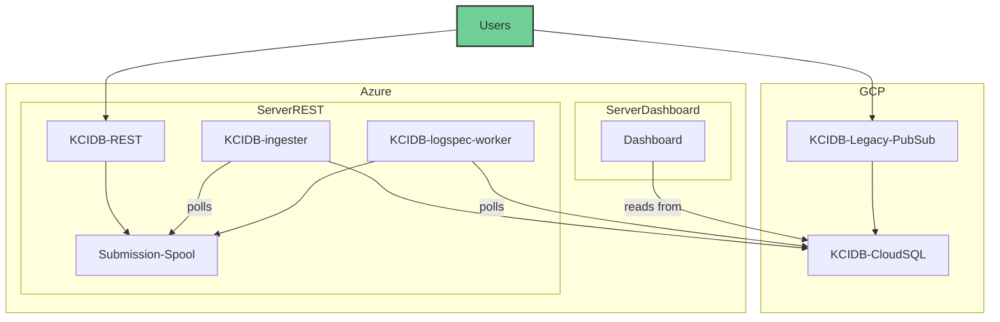
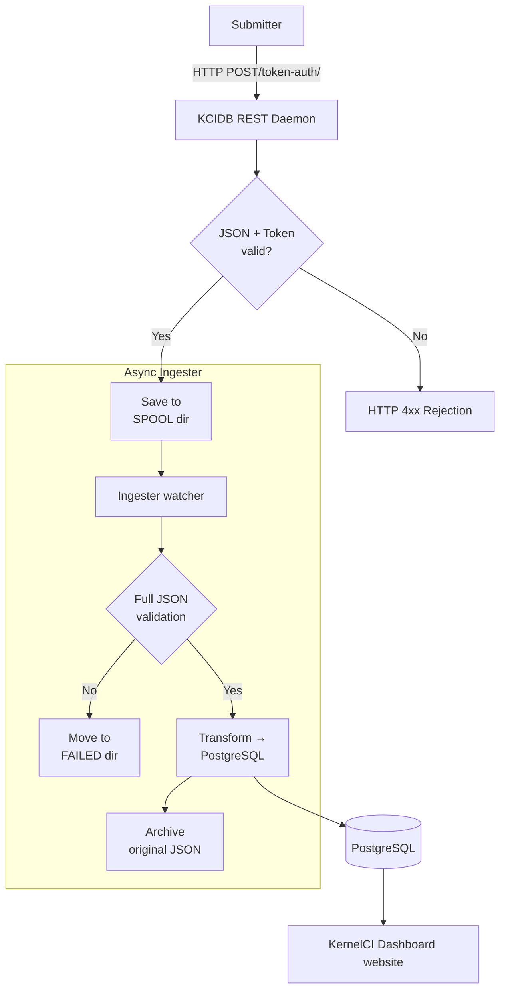

# KCIDB-NG Submitter Guide
This document provides guidelines for submitting results of Linux kernel testing (builds, tests, incidents, issues) to the KernelCI KCIDB-NG project. 

## Introduction
KCIDB-NG is a database designed to collect and manage data from Linux kernel testing. It is used to track the status of kernel builds, tests, and any issues that arise during testing. KCIDB-NG is one of the components of the KernelCI KCIDB project, which aims to provide a comprehensive view of kernel testing results.

## Prerequisites
Before you start submitting data to KCIDB-NG, ensure that you have the following:
1. **KernelCI tokens**: You will need authentication tokens to submit data to KCIDB-NG. These tokens can be obtained from the KernelCI team. Please refer to the [KernelCI contacts](https://docs.kernelci.org/contacts/) for more information on how to obtain these tokens.
2. **Build and test infrastructure**: You should have a build infrastructure for Linux kernel testing that can provide results in a format compatible with KCIDB-NG. This includes the ability to build kernels, run tests, and collect results.
3. **Knowledge of JSON**: KCIDB-NG uses JSON as the data format for submissions. You should be familiar with JSON and how to format your data accordingly.


## Who can submit?
1) Anyone who has a build infrastructure for Linux kernel testing and can provide results in a format that is compatible with KCIDB-NG. We require kernel configuration, information about the build environment, build results, build logs, and a few other details.
2) The same applies to testing built kernels. We require test results, test logs, and information about the test environment (device type, configuration, etc). You can use kernel builds from KCIDB to test your own hardware, or you can use your own kernel builds to test hardware from KCIDB.
3) Both build and test results can be submitted by the same submitter or by different submitters.

## How to submit?
1) **Prepare your data**: Ensure you have all the necessary information ready, including kernel configuration, build environment details, test results, and logs. You can see details about the required fields in the [KCIDB-NG schema](https://github.com/kernelci/kcidb-io/blob/main/kcidb_io/schema/v05_03.py).
2) **Format your data**: Make sure your data is in a format that is compatible with KCIDB-NG. This will involve converting your data to JSON. Refer to the [KCIDB-NG API documentation](https://github.com/kernelci/kcidb-io/blob/main/kcidb_io/api/v05_03.py) for more information on the required data format.
3) **Contact the KernelCI team**: If you have any questions or need assistance with the submission process, please reach out to the KernelCI team [KernelCI contacts](https://docs.kernelci.org/contacts/). They can provide staging and production endpoints for submitting your data, and tokens for authentication.
4) **Submit your data**: Once you have prepared and formatted your data, you can submit it to KCIDB-NG over the REST API. Use the provided staging or production endpoints, and include your authentication token in the request headers. The KernelCI team can assist you with this step if needed.
5) **Monitor your submission**: After submitting your data, you can monitor the status of your submission through the KCIDB-NG interface. The KernelCI team can also assist you with any issues that arise during the submission process.
6) **Check the Dashboard**: Once your submission is processed, you can check the [KernelCI Staging Dashboard](https://staging-dashboard.kernelci.org/) to see if your data is visible. The Dashboard provides a user interface to view the status of your submissions and the results of kernel testing.
7) **Iterate and improve**: Based on the feedback from the KernelCI team and the results of your submissions, you can iterate on your data submission process to improve the quality and accuracy of your submissions.
8) **Move to production**: Once you are satisfied with your submissions and the feedback from the KernelCI team, you can move your submissions to the production environment. The KernelCI team can assist you with this step as well.

## Frequently Asked Questions (FAQ)

### KCIDB submission URI looks strange

The KCIDB-NG submission URI is designed to be unique and to include the token for authentication. For example, a typical production submission URI might look like this:

```
https://verylongtoken@db.kernelci.org/
```

While it looks a bit confusing, but this is not how tokens are used, token should be sent as header, not in the URI. The URI is just a placeholder to indicate that the token is required for authentication. And, the actual submission will be made to the `/submit` endpoint of the KCIDB-NG REST API, we specify just base URL in the URI.


### How HTTP REST Submission works?

The KCIDB-NG submission process is based on HTTP REST API. You will need to send a POST request to the KCIDB-NG REST API endpoint with your data in JSON format. The request should include an authentication token in the headers to verify your identity.
Example of submission request using curl available in the [README](https://github.com/kernelci/kcidb-ng/README.md) , section `Sending Data to the API`. Note, submission endpoint is always `/submit` and the request body must be a valid JSON object.


### What does a typical submission file look like?

```
{
  "version": {
    "major": 5,
    "minor": 1
  },
  "tests": [
    {
      "build_id": "maestro:687d72f82ce2c1874edf57a4",
      "id": "ti:783b28417d524d40ab3e43bd",
      "origin": "ti",
      "environment": {
        "compatible": [
          "ti,dra718-evm",
          "ti,dra718",
          "ti,dra722",
          "ti,dra72",
          "ti,dra7"
        ],
        "comment": "Runtime: opentest-ti",
        "misc": {
          "platform": "ti,dra718-evm",
          "measurement": null,
          "job_id": "8_533930518",
          "job_context": null
        }
      },
      "path": "boot",
      "log_url": "http://files.kernelci.org//ti/mainline/master/v6.16-rc7/arm/multi_v7_defconfig+kselftest/gcc-12/baseline-boot-dra71x-evm.txt.gz",
      "status": "PASS",
      "start_time": "2025-07-20T23:59:13.000000Z",
      "misc": {
        "runtime": "opentest-ti",
        "maestro_viewer": null,
        "job_url": null,
        "error_code": null,
        "error_msg": null
      }
    }
  ]
}
```

Where you can see the following fields:
- `version`: The version of the KCIDB-NG schema being used.
- `tests`: An array of test results, where each test result contains:
  - `build_id`: The ID of the build associated with the test. **It must match the build ID in the KCIDB-NG database in the builds collection.**
  - `id`: The unique identifier for the test.
  - `origin`: The origin of the test (e.g., "ti" for Texas Instruments, "maestro" for KernelCI Maestro, and so on).
  - `environment`: Details about the test environment, including compatible devices and additional metadata.
  - `path`: The path or type of test being performed (e.g., "boot").
  - `log_url`: A URL to the log file for the test.
  - `status`: The status of the test (e.g., "PASS", "FAIL").
  - `start_time`: The time when the test started.
  - `misc`: Additional miscellaneous information related to the test.

This is a minimal example of a test submission. A submission can contain multiple tests, or builds and tests together, and might even include incidents and issues. 

### I've submitted the data, what happens next?
After you submit your data, it will be processed by the KCIDB-NG system.
Here is how the current system architecture works:



And this is how your submission will be processed:


### How can I troubleshoot my submission?
If you encounter issues with your submission, you can check the following:
1. **Submission returned HTTP status code**: Ensure that your submission was successful. A 200 OK status indicates success, while 4xx or 5xx status codes indicate errors. Usually the response body will contain details about the error.
2. **Submission ID**: On successful submission, you will receive a submission ID in the response body. You can use this ID to track your submission in the KCIDB-NG system.
3. **Submission diagnostics API**: You can use the diagnostics API to check the status of your submission. This API will provide information about the processing of your submission, including any errors that occurred during validation or ingestion. Check [READMEs](https://github.com/kernelci/kcidb-ng/README.md), section `Checking status` for more details.
4. **Dashboard**: The KernelCI Dashboard provides a user interface to view the status of your submissions. If prior diagnostics show that your submission was successful, you can check the Dashboard to see if your data is visible.

### Data retention policy
The data retention policy for KCIDB-NG is not yet finalized, so this is draft policy:
- By default data will be retained for 6 months.
- `Failed` submissions will be retained for 1 week.
- `Archived` submissions will be retained for 1 year on Object Storage.

## Data privacy and security
When submitting data to KCIDB-NG, please ensure that you do not include any sensitive or personally identifiable information (PII) in your submissions.

## Builds and tests status codes
- **PASS**: Test or build has passed successfully.
- **FAIL**: Test or build has failed.
- **SKIP**: Test or build was skipped due to some reason (e.g., unsupported configuration, missing dependencies).
- **ERROR**: An error occurred during the test or build process, preventing it from completing successfully, this is infrastructure error, not a test or build error.

## Staging and Production guidelines

When submitting data to KCIDB-NG, you can use either the staging or production endpoints. The staging environment is used for testing and development purposes, while the production environment is used for live submissions, where kernel developers and maintainers can access the data and rely on it for their work. It is important to ensure that any data submitted to the production environment is thoroughly tested and validated to avoid any disruptions to the live system and to not affect the work of kernel developers and maintainers.